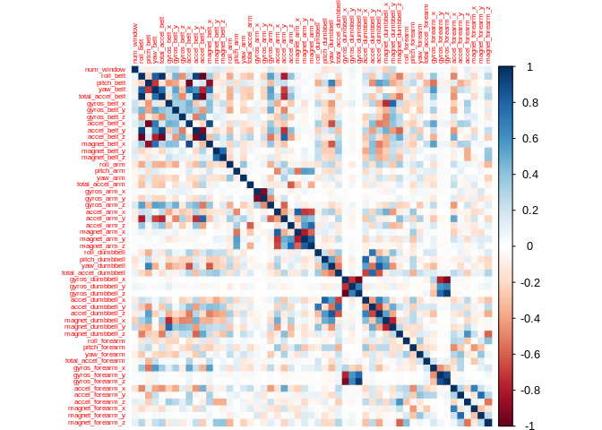
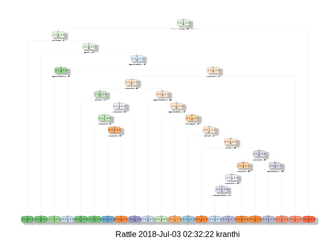
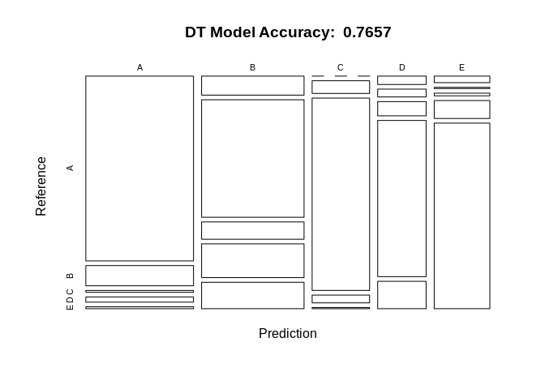
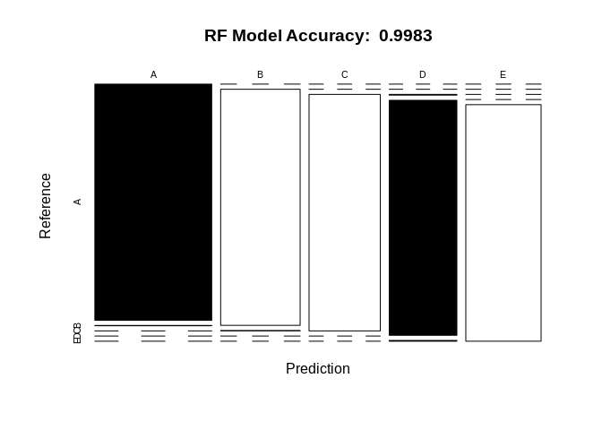
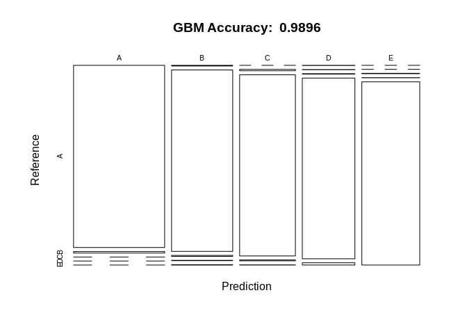

Practical Machine Learning Course Activity Recognition Project Report
=====================================================================

This document is a write up of the assignment for [Practical Machine Learning MOOC offered by John Hopkins University](https://www.coursera.org/learn/practical-machine-learning) on Coursera.

Problem Statement
=================

Using devices such as Jawbone Up, Nike FuelBand, and Fitbit it is now possible to collect a large amount of data about personal activity relatively inexpensively. These type of devices are part of the quantified self movement – a group of enthusiasts who take measurements about themselves regularly to improve their health, to find patterns in their behavior, or because they are tech geeks. One thing that people regularly do is quantify how much of a particular activity they do, but they rarely quantify how well they do it. In this project, your goal will be to use data from accelerometers on the belt, forearm, arm, and dumbell of 6 participants. They were asked to perform barbell lifts correctly and incorrectly in 5 different ways. More information is available from the website here: [link](http://web.archive.org/web/20161224072740/http:/groupware.les.inf.puc-rio.br/har) (see the section on the Weight Lifting Exercise Dataset).

Aim of the project
==================

The goal of this project is to predict the manner in which they did the exercise. This is the "classe" variable in the training set. You may use any of the other variables to predict with. You should create a report describing how you built your model, how you used cross validation, what you think the expected out of sample error is, and why you made the choices you did. You will also use your prediction model to predict 20 different test cases.

Data
====

The training data for this project are available here:

<https://d396qusza40orc.cloudfront.net/predmachlearn/pml-training.csv>

The test data are available here:

<https://d396qusza40orc.cloudfront.net/predmachlearn/pml-testing.csv>

The data for this project come from this source: <http://web.archive.org/web/20161224072740/http:/groupware.les.inf.puc-rio.br/har>. If you use the document you create for this class for any purpose please cite them as they have been very generous in allowing their data to be used for this kind of assignment.

Reproducibility
===============

To produce the same results by following this notebook. you need to set the seed as given below.

``` r
set.seed(24323)
```

Also I use the following libraries for this project, which you will have to install inorder to attain the same results

``` r
library(rattle)
```

    ## Rattle: A free graphical interface for data science with R.
    ## Version 5.1.0 Copyright (c) 2006-2017 Togaware Pty Ltd.
    ## Type 'rattle()' to shake, rattle, and roll your data.

``` r
library(caret)
```

    ## Loading required package: lattice

    ## Loading required package: ggplot2

``` r
library(corrplot)
```

    ## corrplot 0.84 loaded

``` r
library(rpart)
library(rpart.plot)
library(randomForest)
```

    ## randomForest 4.6-14

    ## Type rfNews() to see new features/changes/bug fixes.

    ## 
    ## Attaching package: 'randomForest'

    ## The following object is masked from 'package:ggplot2':
    ## 
    ##     margin

    ## The following object is masked from 'package:rattle':
    ## 
    ##     importance

``` r
library(RColorBrewer)
```

Load data
=========

Download the dataset and then create partitions, of training dataset (containing 70% of the data) and test set (with 30% of the data).

``` r
setwd("~/practical-machine-learning/")
trainDataURL <-"https://d396qusza40orc.cloudfront.net/predmachlearn/pml-training.csv"
testDataURL <- "https://d396qusza40orc.cloudfront.net/predmachlearn/pml-testing.csv"

# download the data
trainData <- read.csv(url(trainDataURL))
testData <- read.csv(url(testDataURL))

# create partition
inTrain <- createDataPartition(trainData$classe, p=0.7, list=FALSE)
trainSet <- trainData[inTrain, ]
testSet <- trainData[-inTrain, ]

dim(trainSet)
```

    ## [1] 13737   160

``` r
dim(testSet)
```

    ## [1] 5885  160

From above we can see that, the dataset has 160 variables in total. Before further continuing with exploration of data, we have to clean the data.

Cleaning data
=============

This step is required to clean the dataset by eliminating any observations with missing values as well as variables which are not important

Near Zero Variance(NZV) variables are removed as follows:

``` r
# find all NZV
NZV <- nearZeroVar(trainSet)
# remove them from the datasets
trainSet <- trainSet[,-NZV]
testSet <- testSet[,-NZV]
```

``` r
dim(trainSet)
```

    ## [1] 13737   101

``` r
dim(testSet)
```

    ## [1] 5885  101

Now remove variables that contain mostly NA values

``` r
#get all na
naVals <- sapply(trainSet, function(val) mean(is.na(val))) > 0.95
#remove all na
trainSet <- trainSet[, naVals==FALSE]
testSet <- testSet[, naVals==FALSE]
dim(trainSet)
```

    ## [1] 13737    59

``` r
dim(testSet)
```

    ## [1] 5885   59

Remove id variables i.e from column 1 to 5

``` r
trainSet <- trainSet[, -(1:5)]
testSet <- testSet[, -(1:5)]
dim(trainSet)
```

    ## [1] 13737    54

``` r
dim(testSet)
```

    ## [1] 5885   54

So, now our cleaned data consists of 54 variables for analysis. Lets proceed to exploration analysis.

Exploration Analysis
====================

Before modeling, we need to find out if there is any interesting pattern among data or any correlation that is already existing. We shall use corrplot to plot correlation among variables.

``` r
# cor of 54 variables of trainSet
corrMatrix <- cor(trainSet[, -54])
corrplot(corrMatrix, method = "color", tl.cex = 0.5)
```



From the above diagram we can see that few of the variables are correlated, referring to the dark spots in the plot. We can observe both positive and negative correlations from the plot above.

Lets proceed to the modelling part of data.

Building Prediction Model
=========================

For building a prediction model, we are going to apply three algorithms seperately and measure the accuracies against the test dataset. We shall elect the one which has the best accuracy. The algorithms that we are going to try are: Decision trees, Random Forests and Generalized Boost Model.

### Decision trees

``` r
# using rpart from rpart library
dtModel <- rpart(classe ~ ., data=trainSet, method="class")
# lets plot the dtModel
fancyRpartPlot(dtModel)
```



Lets perform prediction on the test set using the decision tree model

``` r
dtPrediction <- predict(dtModel, newdata=testSet, type="class")
# create confustion matrix for predicted and actual values
dtConfMat <- confusionMatrix(dtPrediction, testSet$classe)
dtConfMat
```

    ## Confusion Matrix and Statistics
    ## 
    ##           Reference
    ## Prediction    A    B    C    D    E
    ##          A 1473  161   15   41   15
    ##          B  144  891  131  256  200
    ##          C    0   54  818   33    5
    ##          D   30   28   51  560   98
    ##          E   27    5   11   74  764
    ## 
    ## Overall Statistics
    ##                                           
    ##                Accuracy : 0.7657          
    ##                  95% CI : (0.7546, 0.7764)
    ##     No Information Rate : 0.2845          
    ##     P-Value [Acc > NIR] : < 2.2e-16       
    ##                                           
    ##                   Kappa : 0.7028          
    ##  Mcnemar's Test P-Value : < 2.2e-16       
    ## 
    ## Statistics by Class:
    ## 
    ##                      Class: A Class: B Class: C Class: D Class: E
    ## Sensitivity            0.8799   0.7823   0.7973  0.58091   0.7061
    ## Specificity            0.9449   0.8460   0.9811  0.95794   0.9756
    ## Pos Pred Value         0.8639   0.5493   0.8989  0.73012   0.8672
    ## Neg Pred Value         0.9519   0.9418   0.9582  0.92106   0.9365
    ## Prevalence             0.2845   0.1935   0.1743  0.16381   0.1839
    ## Detection Rate         0.2503   0.1514   0.1390  0.09516   0.1298
    ## Detection Prevalence   0.2897   0.2756   0.1546  0.13033   0.1497
    ## Balanced Accuracy      0.9124   0.8141   0.8892  0.76942   0.8409

Visualize the confusion matrix results for ease of understanding

``` r
plot(dtConfMat$table, col = dtConfMat$byClass, main = paste("DT Model Accuracy: ",round(dtConfMat$overall['Accuracy'], 4)))
```



### Random Forest analysis

``` r
# using the trainControl method from caret library
rfCtrl <- trainControl(method="cv", number = 3, verboseIter = FALSE)
rfModel <- train(classe ~ ., data=trainSet, method="rf", trControl=rfCtrl)
rfModel$finalModel
```

    ## 
    ## Call:
    ##  randomForest(x = x, y = y, mtry = param$mtry) 
    ##                Type of random forest: classification
    ##                      Number of trees: 500
    ## No. of variables tried at each split: 27
    ## 
    ##         OOB estimate of  error rate: 0.19%
    ## Confusion matrix:
    ##      A    B    C    D    E  class.error
    ## A 3905    0    0    0    1 0.0002560164
    ## B    3 2653    2    0    0 0.0018811136
    ## C    0    6 2390    0    0 0.0025041736
    ## D    0    0    9 2243    0 0.0039964476
    ## E    0    1    0    4 2520 0.0019801980

Now perform prediction on test dataset and then create confusion matrix

``` r
# do prediction on testSet
rfPrediction <- predict(rfModel, newdata = testSet)
# create confusion matrix
rfConfMat <- confusionMatrix(rfPrediction, testSet$classe)
rfConfMat
```

    ## Confusion Matrix and Statistics
    ## 
    ##           Reference
    ## Prediction    A    B    C    D    E
    ##          A 1674    2    0    0    0
    ##          B    0 1137    2    0    0
    ##          C    0    0 1021    0    0
    ##          D    0    0    3  964    3
    ##          E    0    0    0    0 1079
    ## 
    ## Overall Statistics
    ##                                           
    ##                Accuracy : 0.9983          
    ##                  95% CI : (0.9969, 0.9992)
    ##     No Information Rate : 0.2845          
    ##     P-Value [Acc > NIR] : < 2.2e-16       
    ##                                           
    ##                   Kappa : 0.9979          
    ##  Mcnemar's Test P-Value : NA              
    ## 
    ## Statistics by Class:
    ## 
    ##                      Class: A Class: B Class: C Class: D Class: E
    ## Sensitivity            1.0000   0.9982   0.9951   1.0000   0.9972
    ## Specificity            0.9995   0.9996   1.0000   0.9988   1.0000
    ## Pos Pred Value         0.9988   0.9982   1.0000   0.9938   1.0000
    ## Neg Pred Value         1.0000   0.9996   0.9990   1.0000   0.9994
    ## Prevalence             0.2845   0.1935   0.1743   0.1638   0.1839
    ## Detection Rate         0.2845   0.1932   0.1735   0.1638   0.1833
    ## Detection Prevalence   0.2848   0.1935   0.1735   0.1648   0.1833
    ## Balanced Accuracy      0.9998   0.9989   0.9976   0.9994   0.9986

Lets plot the matrix results for ease of understanding

``` r
plot( rfConfMat$table, col = rfConfMat$byClass, main=paste("RF Model Accuracy: ", round(rfConfMat$overall['Accuracy'], 4) ))
```



Random Forest model beats Decision Tree model by a great margin. Now, lets continue and apply the GB model.

### Generalized Boost Model

``` r
gbmCtrl <- trainControl(method="repeatedcv", number=5, repeats = 1)
gbModel <- train(classe ~ ., data = trainSet, method="gbm", trControl = gbmCtrl, verbose=FALSE)
gbModel$finalModel
```

    ## A gradient boosted model with multinomial loss function.
    ## 150 iterations were performed.
    ## There were 53 predictors of which 43 had non-zero influence.

Now lets apply test dataset for prediction and create confusion matrix and then find out the accuracy.

``` r
gbmPrediction <- predict(gbModel, newdata=testSet)
#create confusion matrix
gbmConfMat <- confusionMatrix(gbmPrediction, testSet$classe)
gbmConfMat
```

    ## Confusion Matrix and Statistics
    ## 
    ##           Reference
    ## Prediction    A    B    C    D    E
    ##          A 1669   14    0    0    0
    ##          B    4 1116    6    2    2
    ##          C    0    8 1016    5    1
    ##          D    1    1    2  956   12
    ##          E    0    0    2    1 1067
    ## 
    ## Overall Statistics
    ##                                           
    ##                Accuracy : 0.9896          
    ##                  95% CI : (0.9867, 0.9921)
    ##     No Information Rate : 0.2845          
    ##     P-Value [Acc > NIR] : < 2.2e-16       
    ##                                           
    ##                   Kappa : 0.9869          
    ##  Mcnemar's Test P-Value : NA              
    ## 
    ## Statistics by Class:
    ## 
    ##                      Class: A Class: B Class: C Class: D Class: E
    ## Sensitivity            0.9970   0.9798   0.9903   0.9917   0.9861
    ## Specificity            0.9967   0.9971   0.9971   0.9967   0.9994
    ## Pos Pred Value         0.9917   0.9876   0.9864   0.9835   0.9972
    ## Neg Pred Value         0.9988   0.9952   0.9979   0.9984   0.9969
    ## Prevalence             0.2845   0.1935   0.1743   0.1638   0.1839
    ## Detection Rate         0.2836   0.1896   0.1726   0.1624   0.1813
    ## Detection Prevalence   0.2860   0.1920   0.1750   0.1652   0.1818
    ## Balanced Accuracy      0.9968   0.9884   0.9937   0.9942   0.9928

Now lets visualize the matrix results for ease of understanding

``` r
plot(gbmConfMat$table, col = gbmConfMat$byClass, main=paste("GBM Accuracy: ", round(gbmConfMat$overall['Accuracy'],4)))
```



Although Generalized Boost Model outperformed the Decision Tree Model, it is still less accurate than the Random Forest Model by a little margin. Therefore, we shall continue building our final model using `Random Forest Model`

Final Model Applied on Test Data
================================

The winner of the above model analysis i.e `Random Forest Model` will be used to predict the 20 quiz results

``` r
predictions <- predict(rfModel, newdata = testData)
predictions
```

    ##  [1] B A B A A E D B A A B C B A E E A B B B
    ## Levels: A B C D E
